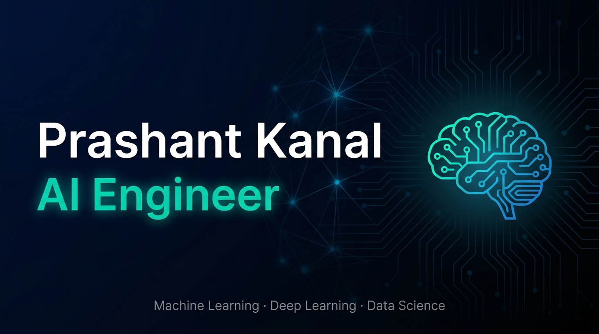

<!-- Header Wave -->
<p align="center">
  
</p>

<!-- Typing Animation -->
<p align="center">
  
</p>

<!-- Social Badges -->
<p align="center">
  <a href="https://www.linkedin.com/in/pawadi-kanal-0665472a2/">
    
  </a>
  <a href="mailto:kanalpawadi@gmail.com">
    
  </a>
  <a href="https://www.instagram.com/kanal.prashant/">
    
  </a>
  <a href="./resume/Kanal_Pawadi_Resume.pdf">
    
  </a>
</p>

<p align="center">
  
  &nbsp;
  
  &nbsp;
  
</p>

---

## 👨‍💻 About Me

```python
class KanalPawadiPiragond:
    name       = "Kanal Pawadi Piragond"
    alias      = "kanalpawadi"
    role       = "AI & Data Science Engineer | Generative AI | Full-Stack Dev"
    education  = "B.Tech AI & DS (Hons: Big Data Analysis) — CGPA 9.04/10"
    college    = "DKTE Society's T&E Institute, Ichalkaranji (NAAC A+) — 2023–2027"
    location   = "Sangli, Maharashtra, India 🇮🇳"

    expertise  = ["LangChain", "RAG Systems", "LLM Agentic Workflows",
                  "Next.js", "React", "TypeScript", "Python ML"]

    highlights = [
        "🏆 First Prize — GI-AI-SC 2026, MIT World Peace University",
        "📄 Published Researcher — Springer ICDAM-2026",
        "🔥 LeetCode: 250+ problems | 100-Day Streak",
        "☁️  AWS Academy Data Engineering Certified",
        "🥈 Finalist — National Hackathon, IIT Roorkee",
    ]

    currently  = "Building production-grade AI systems & open to collaborations"
```

---

## 🏆 Achievements & Awards

<!-- <p align="center">
  
</p> -->

| 🥇 | Achievement |
|:---:|---|
| 🏆 | **First Prize** — Global Interdisciplinary AI Student Competition (GI-AI-SC 2026), MIT World Peace University — Led 3-member team, shipped a production-grade AI system in 48 hours |
| 📄 | **Published Researcher** — ICDAM-2026 (Springer) — Lead author, *"DigiHeR: Scalable AI-based Framework of Crowdsourced 3D Cultural Heritage Reconstruction with WebXR"*; 4.6–5.9mm RMSE accuracy, 96%+ success rate |
| ☁️ | **AWS Academy Data Engineering** — 40 hrs (Apr 2026) |
| 🥈 | **Finalist** — National Level Hackathon, IIT Roorkee |
| 💻 | **LeetCode 250+** problems solved (Java, C) — DP, Arrays, Hash Tables, Greedy; 100-Day Streak |

---

## 💼 Work Experience

### 🤖 Generative AI Engineer Intern — Sunbeam Institute, Pune &nbsp; `Dec 2025 · 1 Month`

- Built a **RAG chatbot** using LangChain + Groq API, reducing inference latency **30%** vs. an OpenAI baseline
- Automated data ingestion with **Selenium + ChromaDB** for consistent semantic retrieval across dynamic documents
- Deployed on **Streamlit Cloud** with REST APIs, automating ~**35% of routine FAQ support**

---

## 🚀 Key Projects

### 🎓 [Clunite](https://github.com/kanalpawadi) — Campus Event & Club Management Platform &nbsp; `Current · Final-Year Project`
> `Next.js 14` `React 18` `TypeScript` `Supabase` `PostgreSQL` `Tailwind CSS` `shadcn/ui` `Vercel`

- Built a **full-stack platform** with dual dashboards for students and organizers to discover, register for, and manage campus events and clubs
- Implemented **secure PIN-based club verification**, real-time updates via Supabase, and type-safe forms with React Hook Form + Zod
- Designed an **organizer analytics dashboard**, deployed on Vercel with Blob storage for media handling

---

### ⚡ High-Speed RAG Chatbot — Sunbeam Institute &nbsp; `Dec 2025`
> `Python` `LangChain` `Groq API` `ChromaDB` `Selenium` `Streamlit` `LLaMA 3`

- Architected a **LangChain + Groq LPU RAG pipeline**, cutting latency 30% vs. an OpenAI baseline
- Built a **Selenium-to-ChromaDB auto-ingestion** pipeline supporting dynamic document updates
- Tuned prompt chains to minimize hallucinations, automating ~35% of FAQ support via Streamlit

---

### 📦 AI-Powered Inventory Demand Forecasting System &nbsp; `2025`
> `Python` `ARIMA` `Prophet` `Machine Learning` `Streamlit` `SQL`

- Built an **ARIMA + Prophet forecasting engine** for 14-day inventory predictions, reducing MAE by **22%** vs. baseline
- Deployed a **Streamlit dashboard** with live SQL queries, contributing to an **18% reduction** in overstock costs

---

## 🛠️ Tech Stack

**`Languages`**


**`AI · Generative AI · ML`**


**`Full-Stack Web`**


**`Databases · Cloud`**


**`Tools · DevOps`**


---

## 📊 GitHub Stats

<p align="center">
  &nbsp;&nbsp;
  
</p>

<p align="center">
  
</p>

<p align="center">
  
</p>


---

## 🎓 Education

| Degree | Institute | Score | Year |
|---|---|---|---|
| **B.Tech AI & Data Science** (Hons: Big Data Analysis) | DKTE Society's T&E Institute, Ichalkaranji (NAAC A+) | CGPA **9.04/10** · Hons CGPA **9.00/10** | 2023–2027 |
| Class XII (HSC) | Maharashtra State Board | **71.80%** | 2022 |
| Class X (SSC) | Maharashtra State Board | **91.80%** | 2020 |

---

## 📜 Certifications & Leadership

- ☁️ **AWS Academy Data Engineering** — 40 hrs (Apr 2026)
- 🧑‍💻 **Student Ambassador** — Let's Upgrade EdTech Platform
- 🤝 **Volunteer Lead** — Social Committee, DKTE
- 📣 **Social Media Lead** — DSSA
- 🌍 **Languages:** English (Professional) · Hindi · Marathi · Kannada

---

## 🌐 Connect With Me

<p align="center">
  Open to collaborations on AI/ML projects, research, and full-stack development.<br/>
  Let's build something impactful together — reach out anytime!
</p>

<p align="center">
  <a href="https://www.linkedin.com/in/pawadi-kanal-0665472a2/">
    
  </a>
  <a href="mailto:kanalpawadi@gmail.com">
    
  </a>
  <a href="https://www.instagram.com/kanal.prashant/">
    
  </a>
  <a href="./resume/Kanal_Pawadi_Resume.pdf">
    
  </a>
</p>

<!-- Footer Wave -->
